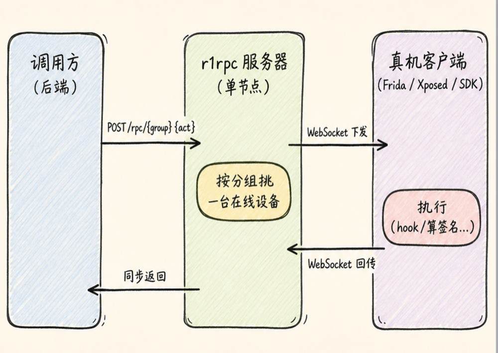
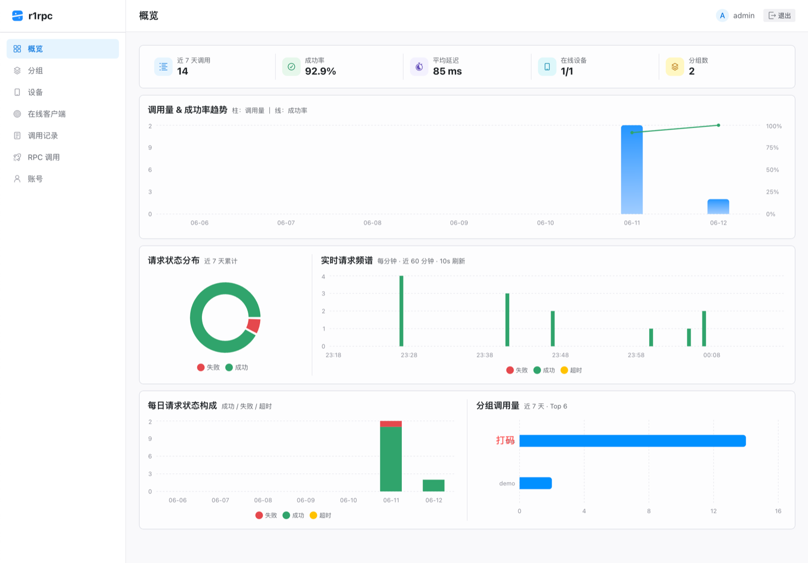

<p align="center">
  
</p>

# r1rpc

**把只能在真机/特定环境里跑的函数，封装成一个 HTTP 接口。**

有些能力天生离不开设备——iOS 的 DeviceCheck / App Attest、App 内部的加密签名、必须真机环境才肯出活的 SDK……服务器上算不出来。r1rpc 让真机挂一个常驻客户端连到中心服务器；调用方发一个普通 HTTP 请求，服务器转发给在线设备执行，再把结果同步带回。一句话：**远程过程调用，但"过程"跑在你的真机上。**

> 🙏 **致谢**：r1rpc 基于 [@manyuegong33](https://github.com/manyuegong33) 的 [r0rpc](https://github.com/manyuegong33/r0rpc) 重构而来——核心架构与中继协议的思路源自原作者，本项目在其基础上重写了后端、配置、面板与部署。特别鸣谢原作者的开源工作。

<p align="center">
  
</p>

---

## 特性

- **同步 RPC over WebSocket**：调用方拿到的是同步结果，设备侧是常驻长连接，毫秒级下发。
- **分组路由 + 负载均衡**：一个分组是一个设备池，同组多台设备自动轮询分发。
- **三套独立鉴权**：后台账号（登面板）、调用方（按分组 none/apikey）、设备（分组 device key）各管各的，互不串味。
- **能力自动发现**：设备登录时上报自己支持的 action，面板直接可见，无需手维护。
- **可观测**：Web 面板含实时请求频谱、成功率/延迟趋势、调用审计、设备/客户端状态。
- **单节点、零外部依赖**：只需一个 MySQL，无 Redis；状态在内存里算，明细落库。
- **前端内嵌**：React 面板编译进二进制（`go:embed`），单文件可执行，开箱即用。

---

## 面板预览

<p align="center">
  
</p>

---

## 快速开始

### 方式一：Docker（推荐）

```bash
# 1. 改配置（compose 会把它挂载进容器作为 config.yaml）
#    生产务必修改 jwt_secret / admin.password / mysql.password
vim deploy/config.docker.yaml

# 2. 一键起 服务 + MySQL
docker compose -f deploy/docker-compose.yml up -d --build
```

启动后：

- 面板与接口：`http://localhost:9876`
- 服务首次启动会自动建库建表，并按配置里的 `admin.username` / `admin.password` 创建后台管理员。

### 方式二：从源码运行

需要 Go 1.26+ 和一个 MySQL。

```bash
cp config.example.yaml config.yaml    # 改 jwt_secret / admin 密码 / mysql 连接
go run ./cmd/dbinit                    # 建库建表 + 初始化管理员（可选，server 启动也会做）
go run ./cmd/server                    # 启动服务
```

---

## 配置

配置文件按优先级查找 `config.yaml` → `r1rpc.yaml`；**任意项都可用同名大写环境变量覆盖**（如 `JWT_SECRET`、`MYSQL_HOST`），方便容器部署。完整模板见 [`config.example.yaml`](config.example.yaml)。

```yaml
server:
  http_addr: ":9876"          # 监听地址
  jwt_secret: ""              # 必填：后台 JWT 签名密钥
  time_zone: "Asia/Shanghai"

admin:                         # 首次启动自动创建的后台管理员
  username: "admin"
  password: ""                # 必填

mysql:
  host: "127.0.0.1"
  port: 3306
  user: "root"
  password: ""
  db: "r1rpc"

limits:
  request_timeout_seconds: 25  # 单次调用超时
  client_max_in_flight: 8      # 单设备同时在途请求数
  device_offline_seconds: 20   # 多久无心跳判离线
```

> **对外调用鉴权（none/apikey）不在这里配**，它属于每个分组，在面板的分组页单独设置。

---

## 教程

从零接入一台设备并发起调用的完整步骤（建分组 → 设备端接入 → 发起调用）、以及设备接入的 WebSocket 协议，见 **[docs/tutorial.md](docs/tutorial.md)**。

> 可跑示例：[`examples/`](examples/)（设备端 + 调用方）。

---

## 目录结构

```
cmd/
  server/       服务入口
  dbinit/       建库建表 + 初始化管理员
internal/
  app/          业务编排（登录、调用、结果回收、后台任务）
  rpc/          Hub：设备会话、任务队列、路由分发、并发槽
  web/          HTTP 路由 + WebSocket + 内嵌前端
  store/        MySQL 存取 + schema
  config/       YAML 配置加载
  auth/ model/  JWT / 数据结构
web/            React + Radix Themes 面板（构建后 embed 进二进制）
deploy/         Dockerfile + docker-compose + 配置
```

## 技术栈

Go（标准库 net/http 1.22 路由 + [coder/websocket](https://github.com/coder/websocket)）· MySQL · React 18 + Vite + Radix Themes + Recharts。单节点、无 Redis。
